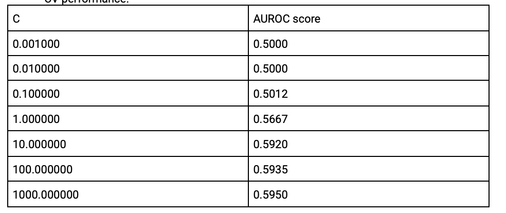
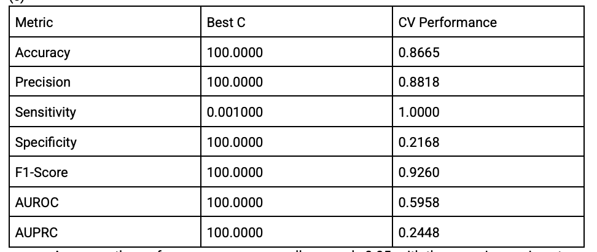

# ICU Mortality Prediction Project

## Overview
This project builds a machine learning model to predict patient mortality in the Intensive Care Unit (ICU) using clinical data. The goal is to develop an interpretable and well-validated classification model that balances predictive performance with clinical relevance.

The dataset comes from the **PhysioNet 2012 Challenge**, which focuses on in-hospital mortality prediction for ICU patients.

**Data Source:**  
https://physionet.org/content/challenge-2012/1.0.0/

---

## Dataset
The dataset contains demographic, physiological, and ICU-related variables collected during the first 48 hours of ICU admission.  
The target variable is **mortality**.

### Key Challenges
- Missing values in clinical measurements  
- Categorical variables (e.g., gender, ICU type)  
- Class imbalance between survivors and non-survivors  

---

## Feature Engineering & Preprocessing

### Categorical Variables
- **Gender** and **ICU Type** are encoded using **one-hot encoding**
- This allows each category to have an independent coefficient
- Avoids assuming ordinal relationships between categories

### Missing Values
- Missing values are imputed using the **mean of the population**
- Assumption: missingness is random and close to the population mean

### Feature Scaling
- Applied **Min-Max normalization** to scale features into the range `[0, 1]`
- Added a small constant to the denominator to avoid division by zero

---

## Model Selection

### Logistic Regression
- Compared **L1** vs **L2** regularized logistic regression using **5-fold cross-validation**
- Both approaches showed similar performance
- **L2 regularization** was selected to retain all features

- ## Regularization Comparison: L1 vs L2 (AUROC-Based Selection)

To further evaluate model robustness and generalization, I compared **L1** and **L2** regularized logistic regression across different regularization strengths using **AUROC** as the primary selection metric.

### Why AUROC?
- AUROC is **threshold-independent**
- It is more informative than accuracy or F1-score under **class imbalance**
- It reflects the model’s ability to **rank positive cases higher than negative cases**, which is critical in clinical risk prediction

---

### Table 1: L1-Regularized Logistic Regression (AUROC-Based CV)

This table shows cross-validated performance metrics for L1 regularization across different values of the inverse regularization strength `C`.

**Key Observations:**
- The best AUROC (≈ 0.596) is achieved at **C = 100**
- Very small values of `C` (strong regularization) result in AUROC ≈ 0.5, equivalent to random guessing
- L1 regularization leads to sparse solutions, but does not significantly outperform L2 in AUROC
- Specificity remains low despite high sensitivity, indicating bias toward predicting the positive class

---

### Table 2: L2-Regularized Logistic Regression (AUROC-Based CV)

This table reports AUROC scores for L2 regularization across a range of `C` values.

**Key Observations:**
- AUROC improves steadily as `C` increases
- The best AUROC (≈ 0.595) is achieved at **C = 1000**
- Performance plateaus beyond moderate regularization strength
- L2 regularization provides more stable performance across values of `C`

---

### Final Regularization Choice

Although **L1 and L2 achieve similar AUROC performance**, **L2 regularization** was selected for the final model for the following reasons:

- Comparable AUROC performance to L1
- Retains all features, improving interpretability in a clinical context
- More stable behavior across different regularization strengths

The final model uses **L2 regularization with C = 100**, balancing AUROC performance with precision–recall behavior observed during validation.

---

### Summary
- AUROC was used to compare L1 vs L2 regularization objectively
- Both norms perform similarly, but L2 offers greater stability and interpretability
- Regularization strength has a meaningful impact on discrimination ability
- Model selection prioritized generalization under class imbalance

**Rationale:**  
In a clinical context, keeping all features allows insight into variables that may have small but meaningful effects on patient outcomes.

---

## Hyperparameter Selection

- Used cross-validation to tune the regularization parameter `C`
- Evaluation metrics:
  - **F1-score**
  - **AUROC**

### Results
| Metric | Best C | Score |
|------|--------|-------|
| F1-score | 100 | 0.922 |
| AUROC | 1000 | 0.602 |

To balance precision and recall, **C = 100** was selected for the final model.

---

## Handling Class Imbalance
When evaluated on the test dataset, the model initially showed poor F1 performance (< 0.3), likely due to class imbalance.

### Solution
- Applied **balanced class weights**
- Each class is weighted inversely proportional to its frequency

This significantly improved the F1-score on test data.

---

## Evaluation Results

### Confusion Matrix (Test Set)

|               | Predicted Positive | Predicted Negative |
|--------------|--------------------|--------------------|
| **Actual Positive** | TP = 6269 | FN = 2191 |
| **Actual Negative** | FP = 357  | TN = 1183 |

### Test Performance
- **F1-score:** **0.829**

---

## Key Takeaways
- Logistic regression with proper preprocessing performs well on ICU mortality prediction
- Class imbalance has a major impact on evaluation metrics
- Balanced class weights substantially improve model performance
- The final model achieves strong predictive performance while remaining interpretable

---

## References
- PhysioNet 2012 Challenge Dataset  
  https://physionet.org/content/challenge-2012/1.0.0/

---

## License
This project is for educational and research purposes. Please follow PhysioNet’s data usage and citation requirements.
